## Hi there 👋

<!-- Social-Networks-Block:START -->
## Social Networks

<!-- Social-Networks-Block:END -->

<!-- Languages-Frameworkds-Tools:START -->
### 🔧Languages Frameworks and Tools🔧
<!-- Languages:START -->

<h3>
     Languages&nbsp;
    
</h3>

[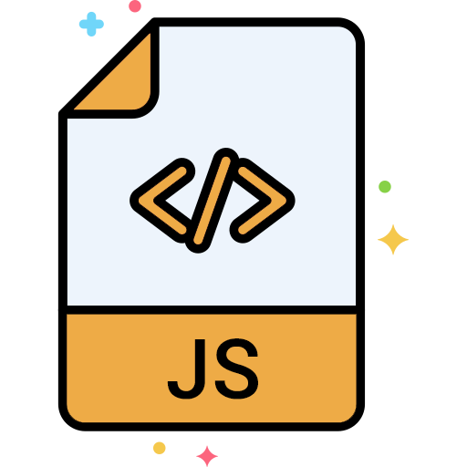](https://developer.mozilla.org/en-US/docs/Web/JavaScript)
[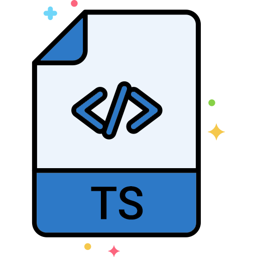](https://www.typescriptlang.org/docs/)
[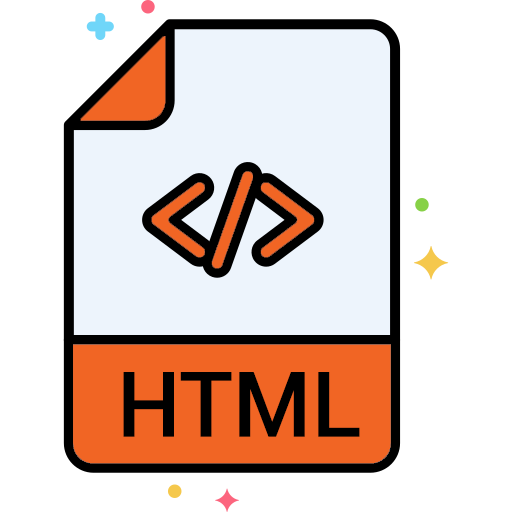](https://developer.mozilla.org/en-US/docs/Web/HTML)
[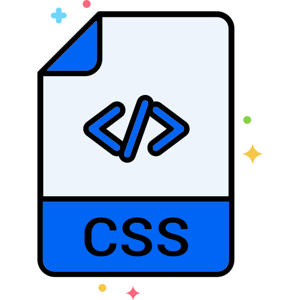](https://developer.mozilla.org/en-US/docs/Web/CSS)
[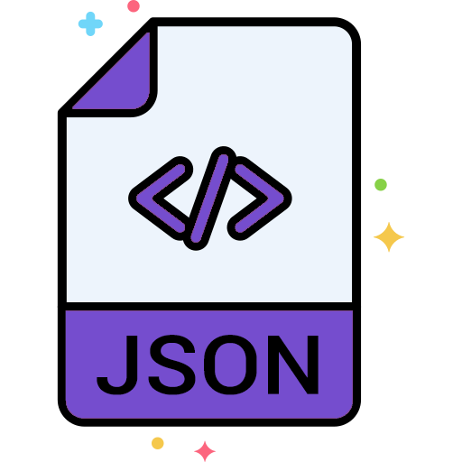](https://www.json.org/json-en.html)
[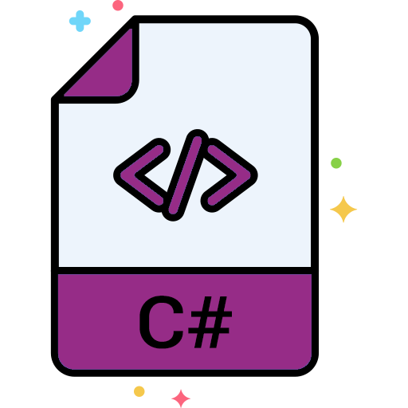](https://learn.microsoft.com/en-us/dotnet/csharp/language-reference/)
[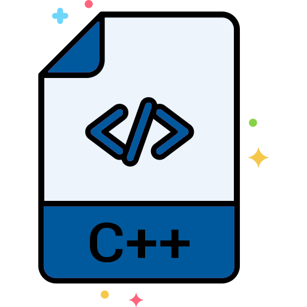](https://learn.microsoft.com/en-us/cpp/cpp/?view=msvc-170)
[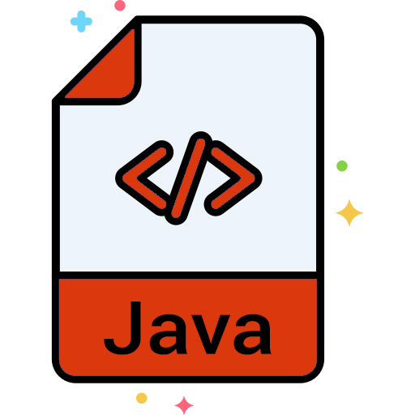](https://docs.oracle.com/javase/8/docs/technotes/guides/language/)

<!-- Languages:END -->
<!-- Frameworks:START -->
<h3>
    Frameworks&nbsp;
    
</h3>

[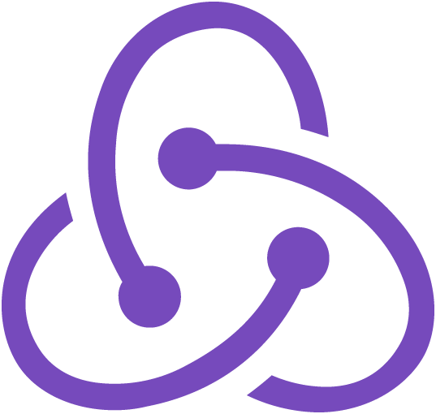](https://redux-toolkit.js.org/)
[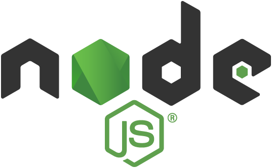](https://nodejs.org/en#gh-light-mode-only)
[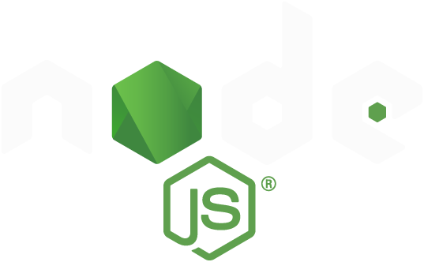](https://nodejs.org/en#gh-dark-mode-only)

[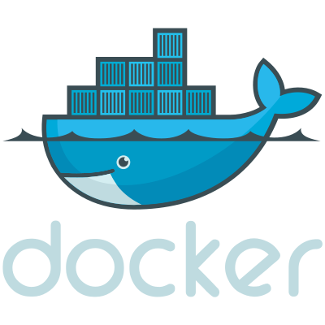](https://www.docker.com/#gh-dark-mode-only)
[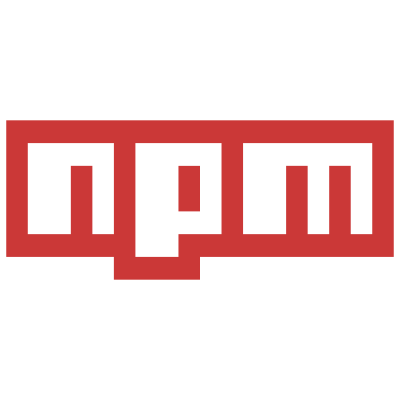](https://www.npmjs.com/)
[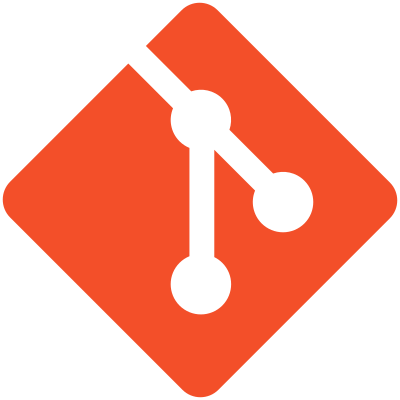](https://en.wikipedia.org/wiki/Git)

[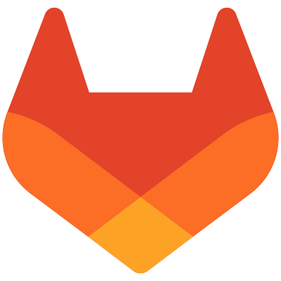](https://about.gitlab.com/)

<!-- Frameworks:END -->
<!-- Languages-Frameworkds-Tools:END -->
###

### Additional information 
<!-- LeetCode:START -->

  
&#128218; Some LeetCode

  <a href="https://leetcode.com/u/Aleeg0/">
     
    <picture>
        <source srcset="https://leetcard.jacoblin.cool/Aleego?theme=light" media="(prefers-color-scheme: light)">
        
    </picture>
  </a>

<!-- LeetCode:END -->
<!-- GitHubStats:START -->

  
&#128125; GitHub Stats

  <a href="https://github.com/Aleeg0">
     
    <picture>
        <source srcset="https://github-readme-stats.vercel.app/api?username=Aleeg0&show_icons=true&theme=catppuccin_latte" media="(prefers-color-scheme: light)">
        
    </picture>
  </a>

<!-- GitHubStats:END -->

[github]: https://github.com/Aleeg0

<!--
**Aleeg0/Aleeg0** is a ✨ _special_ ✨ repository because its `README.md` (this file) appears on your GitHub profile.

Here are some ideas to get you started:

- 🔭 I’m currently working on ...
- 🌱 I’m currently learning ...
- 👯 I’m looking to collaborate on ...
- 🤔 I’m looking for help with ...
- 💬 Ask me about ...
- 📫 How to reach me: ...
- 😄 Pronouns: ...
- ⚡ Fun fact: ...
-->
